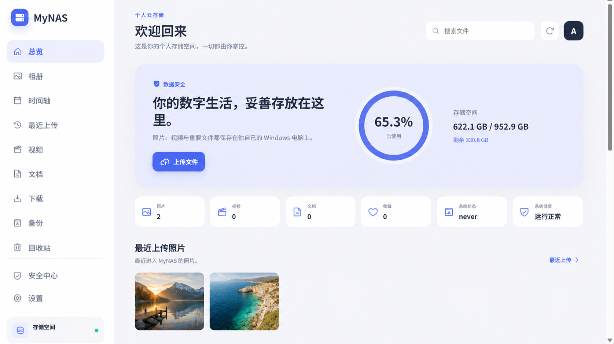
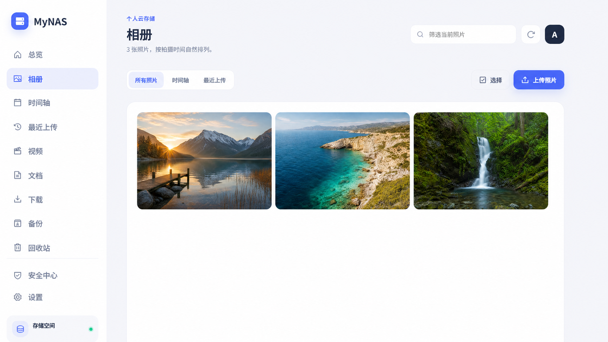
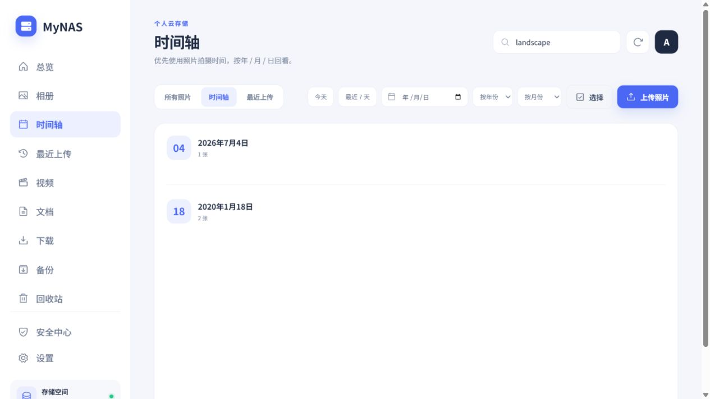
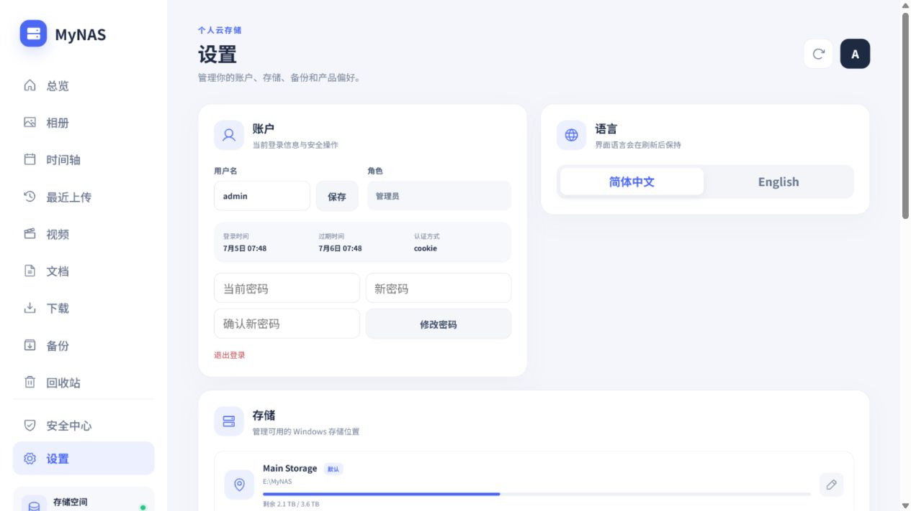
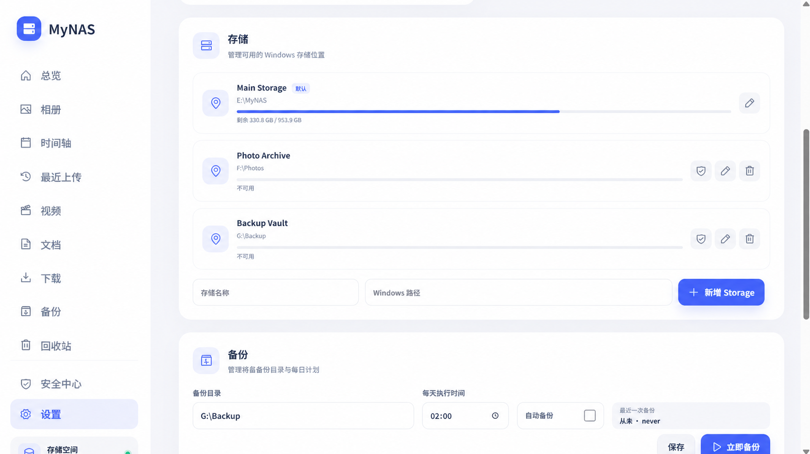
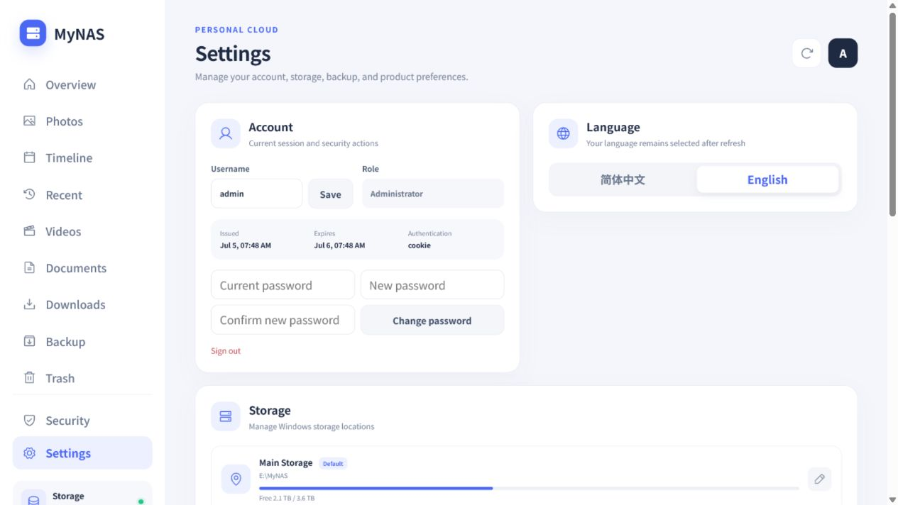
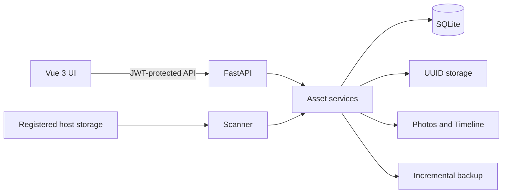

# MyNAS v3.4.0

**A Windows-first, cross-platform personal cloud for managing your own photos and files—locally or remotely.** MyNAS brings an iCloud Photos-style experience to Windows, Linux, and macOS while keeping storage, metadata, authentication, and backups under the owner's control.



MyNAS is a self-hosted application—not a NAS operating system and not an admin-panel template. It combines a photo-first Vue interface with a FastAPI backend, SQLite metadata, secure UUID storage, and an Asset-based access model.

## Why MyNAS exists

MyNAS began with a practical storage problem on my own Windows PC. Over time, I had accumulated several SSDs and hard drives, with photos, documents, and important backups spread across them. I wanted one simple place to organize those disks, protect important data, and access my files and photo library through a browser when needed.

When I looked for an existing solution, I found that Windows-native NAS and personal-cloud projects were surprisingly limited. Some products that covered the features I needed required a paid license or subscription, while many self-hosted projects treated Windows as a secondary platform. I wanted a free and open-source option that could make better use of the Windows computer and storage drives I already owned.

That is why I started MyNAS. It remains Windows-first because that is where the project began, but the backend and storage layer are now compatible with Windows, Linux, and macOS. The goal is to provide a practical, free alternative for managing multiple drives, photos, files, and backups locally while still supporting secure browser-based remote access.

> **项目缘起：** 我的 Windows 主机上有多块固态硬盘和机械硬盘，照片、文件和备份数据分散在不同硬盘里。我需要一个能够统一管理这些存储、保护重要数据，并在需要时通过浏览器访问的个人云系统。但真正针对 Windows 原生环境的 NAS 和个人云项目很少，部分能够满足需求的方案还需要付费。因此，我开始制作 MyNAS，希望它成为一个免费、开源、适合 Windows 用户的照片、文件与备份管理工具。

## Highlights

- Photo library, EXIF-aware timeline, recent uploads, favorites, and full-screen preview.
- Drag-and-drop multi-file upload with progress, localized feedback, and automatic refresh.
- Asset-based file browsing, download, soft deletion, restore, and permanent deletion.
- Database-backed cross-platform Storage Locations with idempotent background reconciliation.
- SHA-256 indexing, UUID storage names, thumbnails, and best-effort EXIF extraction.
- SHA256-verified external backups with atomic snapshots and APScheduler schedules.
- Dashboard metrics, recent activity, storage usage, backup state, and health status.
- Windows one-click launcher with readiness checks, port-conflict diagnostics, safe Tunnel fallback, and optional per-user startup.
- Explicit backend, database, storage, network, session, and Tunnel failure states instead of a generic connection error.
- Settings Center for account, session, language, storage, backup, and preferences.
- Simplified Chinese and English without a heavyweight internationalization framework.
- JWT authentication, HttpOnly cookies, user isolation, IDOR protection, and audit logs.

## Screenshots

| Photos | Timeline |
| --- | --- |
|  |  |

| Settings | Storage Manager |
| --- | --- |
|  |  |

| English interface |
| --- |
|  |

## How it works



`Asset` is the only source of truth for user-visible files. The browser never receives a real disk path and never submits a path for download or deletion. Uploads and trusted filesystem scans remain separate pipelines: uploads validate untrusted input, while the scanner indexes every file in a registered location.

Read [Architecture](docs/ARCHITECTURE.md), [Storage](docs/STORAGE.md), and [Scan System](docs/SCAN_SYSTEM.md) for implementation details.

## Security model

- Every non-login API requires an authenticated user.
- Every Asset belongs to a `user_id`; ownership is checked before file access.
- Download, delete, preview, thumbnail, and favorite operations use an Asset UUID.
- Managed content is stored under `Storage/<user_id>/<asset_uuid>` using the host OS path separator.
- `storage_path` and thumbnail disk paths are never returned by public serializers.
- Uploads enforce extension, MIME, signature, and size checks before Asset creation.
- Uploaded files receive backend-generated UUID names and SHA-256 hashes.
- Login and file operations are recorded with user, action, and time; sensitive request data is redacted.

See [Security Architecture](docs/SECURITY.md).

## Requirements

- Windows 10/11, a current Linux distribution, or macOS
- Python 3.11 or newer
- Node.js 20 or newer with npm
- A local or mounted volume for managed storage

## Quick start

```powershell
# Clone or download the repository, then open PowerShell in its directory.

python -m venv .venv
.\.venv\Scripts\Activate.ps1
python -m pip install -r requirements.txt
npm ci
npm run build

$env:MYNAS_ADMIN_PASSWORD = "replace-with-a-long-random-password"
$env:MYNAS_COOKIE_SECURE = "false"   # local HTTP only
.\Start-MyNAS.bat
```

The launcher waits for `http://127.0.0.1:8000/health`, diagnoses an occupied port without terminating unknown processes, checks the optional local cloudflared connector, and then opens the safest available URL. The initial username is `admin`; the password is the value supplied through `MYNAS_ADMIN_PASSWORD`. If no password is supplied, the local-development fallback is `admin` and MyNAS requires it to be changed after login.

For frontend development, keep the same backend and explicitly request the Vite server:

```powershell
.\start.ps1 -Development
```

### Optional Windows startup

MyNAS never installs hidden persistence. These helpers create or remove one visible shortcut named `MyNAS.lnk` in the current user's Windows Startup folder; no administrator rights, registry changes, or Windows service are used.

```powershell
.\Enable-MyNASStartup.bat
.\Disable-MyNASStartup.bat
```

The shortcut uses the repository's absolute path. Run Enable again after moving the project. Runtime PID and launcher logs are kept under the ignored `.tmp/launcher` directory. The batch entry points use process-scoped PowerShell execution-policy bypass, so run them only from a trusted, unmodified MyNAS checkout.

Linux and macOS use the equivalent startup script:

```sh
python3 -m venv .venv
. .venv/bin/activate
python3 -m pip install -r requirements.txt
npm ci

export MYNAS_ADMIN_PASSWORD="replace-with-a-long-random-password"
export MYNAS_COOKIE_SECURE="false"
./start.sh
```

### Production-style local build

The FastAPI application can serve the compiled Vue application directly:

```powershell
npm ci
npm run build

$env:MYNAS_ADMIN_PASSWORD = "replace-with-a-long-random-password"
$env:MYNAS_COOKIE_SECURE = "false"   # use true behind HTTPS
python -m uvicorn backend.main:app --host 127.0.0.1 --port 8000
```

Open `http://127.0.0.1:8000`. Direct SPA links such as `/photos`, `/photos/timeline`, and `/settings` are supported.

MyNAS defaults to `E:\MyNAS` on Windows and `~/MyNAS` on Linux and macOS. `MYNAS_ROOT` always takes priority. To use another root before the first start:

```powershell
$env:MYNAS_ROOT = "D:\MyNAS"
```

For remote access, keep Uvicorn bound to localhost and place it behind an authenticated HTTPS reverse proxy or Cloudflare Tunnel. Set `MYNAS_COOKIE_SECURE=true` and `MYNAS_PUBLIC_BASE_URL=https://<your-domain>` when HTTPS is active. The in-app Public Access card is read-only: it never creates a Tunnel or changes DNS.

## Install as a PWA

The production build can be installed as a Progressive Web App in Chrome, Edge, and Safari. MyNAS includes a web app manifest, platform icons, standalone display mode, and a service worker that caches only the application shell and versioned static assets.

- Desktop Chrome or Edge: open the production URL and choose **Install MyNAS**.
- Android Chrome: open the HTTPS URL and choose **Add to Home screen** or **Install app**.
- iPhone Safari: use **Share → Add to Home Screen**.

PWA caching does not include `/api/*`, photos, downloads, authentication responses, uploads, or other private user data. Offline file synchronization, background uploads, and push notifications are intentionally not implemented. Mobile installation requires HTTPS; plain LAN addresses such as `http://192.168.x.x` are not secure service-worker origins.

## Storage Locations

Add an absolute host path such as `F:\Photos`, `/mnt/photos`, or `/Volumes/Photos` from Settings. MyNAS stores the location in SQLite and starts one background scan for the current user. The scanner reconciles new, modified, and deleted files, copies managed bytes into UUID storage, generates thumbnails and EXIF metadata best-effort, and makes photos available to Photos, Timeline, and Dashboard.

If the drive is offline, the API preserves the location and returns `scan_required: true` instead of failing the Storage record. See [Storage](docs/STORAGE.md) and [Scan System](docs/SCAN_SYSTEM.md).

## API overview

All paths below are relative to the same MyNAS origin.

| Method | Endpoint | Purpose |
| --- | --- | --- |
| `POST` | `/api/auth/login` | Create an authenticated session |
| `GET` | `/api/auth/me` | Read the current user and session |
| `POST` | `/api/auth/change-password` | Change the account password |
| `GET` | `/api/assets?parent_id=<uuid>` | List database-backed Assets |
| `POST` | `/api/upload` | Upload one or more files |
| `GET` | `/api/assets/{uuid}` | Download an owned Asset |
| `DELETE` | `/api/assets/{uuid}` | Move an Asset to Trash |
| `GET` | `/api/photos` | Read the paginated photo library |
| `GET` | `/api/photos/timeline` | Read the EXIF-aware timeline |
| `GET` | `/api/photos/recent` | Read recent uploads |
| `GET` | `/api/photos/search?q=<text>` | Search all owned photo metadata |
| `PATCH` | `/api/assets/{uuid}/favorite` | Update favorite state |
| `GET` | `/api/trash` | List deleted Assets |
| `POST` | `/api/backups/run` | Run an incremental backup |
| `GET` | `/api/settings/storage` | List Storage Locations |
| `POST` | `/api/settings/storage` | Add a location and trigger scanning |
| `GET` | `/api/dashboard` | Read dashboard and health data |
| `GET` | `/health` | Public sanitized backend/database/storage readiness |
| `GET` | `/api/health` | Authenticated readiness plus configured network state |

Compatibility aliases such as `/api/assets/list` and `/api/asset/{uuid}` remain available, but new clients should use the plural Asset routes. Path-based file APIs are intentionally absent.

## Development and verification

```powershell
python -m pip install -r requirements-dev.txt
python -m pytest -q
npm run build
```

The automated suite covers authentication boundaries, ownership isolation, upload validation, UUID storage, scanner behavior, thumbnails, timeline ordering, Trash, audit logging, backup consistency, and Settings APIs.

## Documentation

- [Architecture](docs/ARCHITECTURE.md)
- [Settings](docs/SETTINGS.md)
- [Storage Locations](docs/STORAGE.md)
- [Scan System](docs/SCAN_SYSTEM.md)
- [Internationalization](docs/I18N.md)
- [Security](docs/SECURITY.md)
- [v3.2.5 Release Notes](docs/RELEASE_v3.2.5.md)
- [v3.2.0 Release Notes](docs/RELEASE_v3.2.0.md)
- [v3.1.0 Release Notes](docs/RELEASE_v3.1.0.md)
- [Changelog](CHANGELOG.md)

## Cloudflare

The repository includes only a safe configuration template at [cloudflare/config.example.yml](cloudflare/config.example.yml). MyNAS does not sign in to Cloudflare, create tunnels, or modify DNS automatically.

## License

MyNAS is released under the [MIT License](LICENSE).
