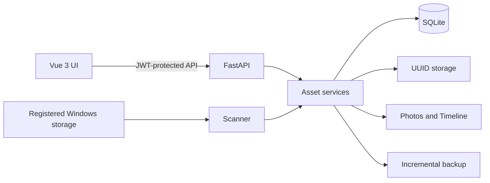

# MyNAS v3.2

**A Windows-native personal cloud for managing your own photos and files—locally or remotely.** MyNAS brings an iCloud Photos-style experience to a Windows PC while keeping storage, metadata, authentication, and backups under the owner's control.


MyNAS is a self-hosted application—not a NAS operating system and not an admin-panel template. It combines a photo-first Vue interface with a FastAPI backend, SQLite metadata, secure UUID storage, and an Asset-based access model.

## Why MyNAS exists

MyNAS started from a personal need: I wanted to upload files to my own storage and manage my photo library when I was away from home, without giving that data to a third-party cloud service.

My main machine already runs Windows. I did not want to replace it with a dedicated NAS operating system, maintain a Linux dual-boot setup, or rebuild the computer around a container-first stack. I wanted a personal cloud that felt native to the Windows machine I already owned. After looking around, I found that polished self-hosted storage projects with first-class Windows support were surprisingly rare, so I decided to build one.

MyNAS is the result: a Windows-native personal cloud that keeps the local computer as the source of storage, adds a secure browser-based photo and file experience, and can be placed behind Cloudflare Tunnel for authenticated remote access.

> **项目缘起：** 我想在外网环境中上传文件、管理自己的照片和 NAS 数据，但不想为此给 Windows 主机安装双系统，也不想把数据交给第三方网盘。由于真正重视 Windows 原生支持的开源个人云项目很少，所以我开始了 MyNAS。

## Highlights

- Photo library, EXIF-aware timeline, recent uploads, favorites, and full-screen preview.
- Drag-and-drop multi-file upload with progress, localized feedback, and automatic refresh.
- Asset-based file browsing, download, soft deletion, restore, and permanent deletion.
- Database-backed Windows Storage Locations with idempotent background reconciliation.
- SHA-256 indexing, UUID storage names, thumbnails, and best-effort EXIF extraction.
- SHA256-verified external backups with atomic snapshots and APScheduler schedules.
- Dashboard metrics, recent activity, storage usage, backup state, and health status.
- Settings Center for account, session, language, storage, backup, and preferences.
- Simplified Chinese and English without a heavyweight internationalization framework.
- JWT authentication, HttpOnly cookies, user isolation, IDOR protection, and audit logs.

## Screenshots

| Photos | Timeline |
| --- | --- |
|  |  |

| Settings | Storage Manager |
| --- | --- |
|  |  |

| English interface |
| --- |
|  |

## How it works



`Asset` is the only source of truth for user-visible files. The browser never receives a real disk path and never submits a path for download or deletion. Uploads and trusted filesystem scans remain separate pipelines: uploads validate untrusted input, while the scanner indexes every file in a registered location.

Read [Architecture](docs/ARCHITECTURE.md), [Storage](docs/STORAGE.md), and [Scan System](docs/SCAN_SYSTEM.md) for implementation details.

## Security model

- Every non-login API requires an authenticated user.
- Every Asset belongs to a `user_id`; ownership is checked before file access.
- Download, delete, preview, thumbnail, and favorite operations use an Asset UUID.
- Managed content is stored under `Storage\<user_id>\<asset_uuid>`.
- `storage_path` and thumbnail disk paths are never returned by public serializers.
- Uploads enforce extension, MIME, signature, and size checks before Asset creation.
- Uploaded files receive backend-generated UUID names and SHA-256 hashes.
- Login and file operations are recorded with user, action, and time; sensitive request data is redacted.

See [Security Architecture](docs/SECURITY.md).

## Requirements

- Windows 10 or Windows 11
- Python 3.11 or newer
- Node.js 20 or newer with npm
- A local Windows volume for managed storage

## Quick start

```powershell
# Clone or download the repository, then open PowerShell in its directory.

python -m venv .venv
.\.venv\Scripts\Activate.ps1
python -m pip install -r requirements.txt
npm ci

$env:MYNAS_ADMIN_PASSWORD = "replace-with-a-long-random-password"
$env:MYNAS_COOKIE_SECURE = "false"   # local HTTP only
.\start.ps1
```

Open `http://127.0.0.1:5173`. The initial username is `admin`; the password is the value supplied through `MYNAS_ADMIN_PASSWORD`. If no password is supplied, the local-development fallback is `admin` and MyNAS requires it to be changed after login.

### Production-style local build

The FastAPI application can serve the compiled Vue application directly:

```powershell
npm ci
npm run build

$env:MYNAS_ADMIN_PASSWORD = "replace-with-a-long-random-password"
$env:MYNAS_COOKIE_SECURE = "false"   # use true behind HTTPS
python -m uvicorn backend.main:app --host 127.0.0.1 --port 8000
```

Open `http://127.0.0.1:8000`. Direct SPA links such as `/photos`, `/photos/timeline`, and `/settings` are supported.

MyNAS defaults to `E:\MyNAS`. To use another root before the first start:

```powershell
$env:MYNAS_ROOT = "D:\MyNAS"
```

For remote access, keep Uvicorn bound to localhost and place it behind an authenticated HTTPS reverse proxy or Cloudflare Tunnel. Set `MYNAS_COOKIE_SECURE=true` when HTTPS is active.

## Storage Locations

Add an absolute Windows directory such as `F:\Photos` from Settings. MyNAS stores the location in SQLite and starts one background scan for the current user. The scanner reconciles new, modified, and deleted files, copies managed bytes into UUID storage, generates thumbnails and EXIF metadata best-effort, and makes photos available to Photos, Timeline, and Dashboard.

If the drive is offline, the API preserves the location and returns `scan_required: true` instead of failing the Storage record. See [Storage](docs/STORAGE.md) and [Scan System](docs/SCAN_SYSTEM.md).

## API overview

All paths below are relative to the same MyNAS origin.

| Method | Endpoint | Purpose |
| --- | --- | --- |
| `POST` | `/api/auth/login` | Create an authenticated session |
| `GET` | `/api/auth/me` | Read the current user and session |
| `POST` | `/api/auth/change-password` | Change the account password |
| `GET` | `/api/assets?parent_id=<uuid>` | List database-backed Assets |
| `POST` | `/api/upload` | Upload one or more files |
| `GET` | `/api/assets/{uuid}` | Download an owned Asset |
| `DELETE` | `/api/assets/{uuid}` | Move an Asset to Trash |
| `GET` | `/api/photos` | Read the paginated photo library |
| `GET` | `/api/photos/timeline` | Read the EXIF-aware timeline |
| `GET` | `/api/photos/recent` | Read recent uploads |
| `GET` | `/api/photos/search?q=<text>` | Search all owned photo metadata |
| `PATCH` | `/api/assets/{uuid}/favorite` | Update favorite state |
| `GET` | `/api/trash` | List deleted Assets |
| `POST` | `/api/backups/run` | Run an incremental backup |
| `GET` | `/api/settings/storage` | List Storage Locations |
| `POST` | `/api/settings/storage` | Add a location and trigger scanning |
| `GET` | `/api/dashboard` | Read dashboard and health data |

Compatibility aliases such as `/api/assets/list` and `/api/asset/{uuid}` remain available, but new clients should use the plural Asset routes. Path-based file APIs are intentionally absent.

## Development and verification

```powershell
python -m pip install -r requirements-dev.txt
python -m pytest -q
npm run build
```

The automated suite covers authentication boundaries, ownership isolation, upload validation, UUID storage, scanner behavior, thumbnails, timeline ordering, Trash, audit logging, backup consistency, and Settings APIs.

## Documentation

- [Architecture](docs/ARCHITECTURE.md)
- [Settings](docs/SETTINGS.md)
- [Storage Locations](docs/STORAGE.md)
- [Scan System](docs/SCAN_SYSTEM.md)
- [Internationalization](docs/I18N.md)
- [Security](docs/SECURITY.md)
- [v3.2.0 Release Notes](docs/RELEASE_v3.2.0.md)
- [v3.1.0 Release Notes](docs/RELEASE_v3.1.0.md)
- [Changelog](CHANGELOG.md)

## Cloudflare

The repository includes only a safe configuration template at [cloudflare/config.example.yml](cloudflare/config.example.yml). MyNAS does not sign in to Cloudflare, create tunnels, or modify DNS automatically.

## License

MyNAS is released under the [MIT License](LICENSE).
