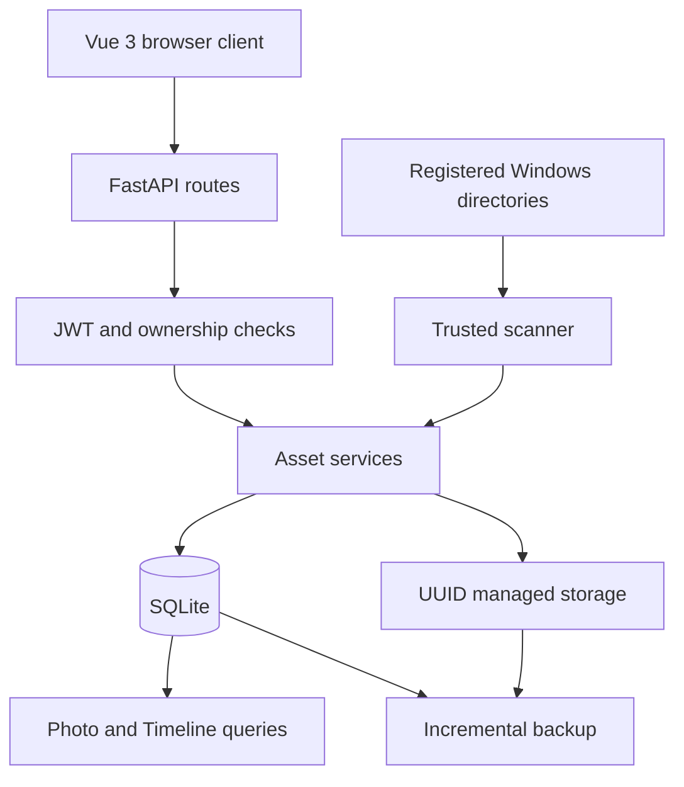

# Architecture

MyNAS v3.1 is a Windows-native personal cloud built as a single FastAPI application with a Vue 3 frontend and SQLite metadata. It deliberately avoids microservices, containers, message brokers, and distributed infrastructure.

## System overview



## Source-of-truth rule

`Asset` is the only source of truth for files presented by MyNAS. A disk file without an Asset is not visible to the UI. The public API serializes an explicit Asset allowlist and never returns `storage_path` or a thumbnail's real path.

An Asset contains the owning user, display filename, internal UUID path, type, size, SHA-256 hash, timestamps, MIME type, parent relationship, deletion state, tags, photo metadata, and favorite state.

## Backend responsibilities

```text
backend/
├── api/          HTTP routes and authentication dependencies
├── core/         JWT, password, rate-limit, and upload security
├── db/           SQLite initialization, migrations, settings, and audit logs
├── models/       API and database-facing data models
├── services/     Asset, file, photo, scanner, backup, and Settings behavior
├── storage/      UUID allocation and internal-path validation
├── utils/        Hashing and size formatting
└── main.py       Application lifecycle and frontend serving
```

The application starts SQLite, ensures the default administrator and root Assets, restores backup scheduling, and optionally imports legacy MyNAS directories. API routes are registered before the compiled Vue fallback so unknown `/api/*` paths still return `404`.

## Frontend responsibilities

The Vue 3 client is a single existing product shell with routes for Dashboard, Photos, Timeline, Recent, file categories, Trash, Security, and Settings. It communicates only through authenticated APIs. A small dictionary in `src/locales/` provides Simplified Chinese and English.

## Upload and scanner separation

The two ingestion paths intentionally do not share trust rules:

- **Upload:** processes untrusted user input, validates filename, extension, MIME type, file signature, and size, then stores the content under a backend-generated UUID.
- **Scanner:** processes an administrator-registered Windows directory, indexes every encountered file type, computes SHA-256, copies content into UUID storage, creates an Asset, and generates photo metadata best-effort.

Both paths converge only at the existing Asset creation and secure storage boundary. See [Scan System](SCAN_SYSTEM.md).

## Read path

1. The API authenticates the JWT and resolves `user_id`.
2. The service loads an Asset by UUID.
3. Ownership and deletion state are checked.
4. The internal path is verified to remain under the user's managed storage root.
5. The response streams the file or returns public metadata.

## Photo path

Photos and Timeline query SQLite Assets where `type='image'`. Capture time uses EXIF metadata when available and falls back to Asset creation time. The UI loads paginated results and authenticated thumbnails by Asset ID.

## Backup path

The backup service reads owned, non-deleted Assets, validates internal storage paths, recomputes SHA-256, and copies only new or changed content. Scheduling uses APScheduler and persists configuration in SQLite.

## Security boundaries

- Deny-by-default API authentication.
- Per-user Asset ownership checks.
- No request-controlled paths for download, delete, or preview.
- Backend-generated UUID storage names.
- Parameterized SQLite queries.
- Audit records for authentication and file operations.
- Localhost binding by default; HTTPS is expected for remote access.
