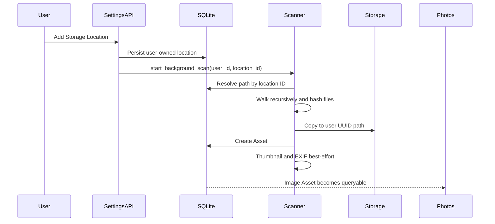

# Scan System

The MyNAS scanner imports trusted filesystem content into the Asset system. It is deliberately separate from the upload pipeline and lives in `backend/services/scan_service.py`.

## Trust boundary

Uploads process untrusted browser input and must call `validate_upload`. The scanner processes an explicitly registered host directory and must not call upload validation, apply the upload MIME whitelist, or skip unknown extensions.

The scanner still classifies known image and video MIME types for presentation. Unknown types are indexed as regular files.

## Registered-storage flow



The API never passes a raw request path to file operations. The scanner receives a location UUID and reloads the owner and path from SQLite.

## File processing

For every encountered file, the scanner:

1. Resolves its parent Asset folder.
2. Computes a stable Asset UUID from the Storage Location and relative path.
3. Computes SHA-256 and compares it with the existing Asset.
4. Creates new files, atomically replaces modified managed bytes, and refreshes metadata.
5. Marks scanner-owned Assets as deleted when their source file disappears.
6. Copies bytes to `Storage/<user_id>/<asset_uuid>` through a verified staging file.
7. Generates a thumbnail and extracts EXIF best-effort for images.

Executable files, unknown extensions, and same-content files at different paths are indexed. This behavior does not affect upload security.

## Concurrency

A process-local guarded set allows one registered-storage scan per user. A second request while a scan is active returns:

```json
{
  "scan_started": false,
  "scan_required": true,
  "message": "A storage scan is already running"
}
```

No queue, Redis instance, message broker, or worker framework is involved.

## Restart safety

Registered-storage Assets use stable UUIDs derived from the location UUID and normalized relative path. Windows uses case-insensitive identity normalization; Linux and macOS preserve case so `Photo.jpg` and `photo.jpg` receive different UUIDs even on case-sensitive APFS volumes. Asset creation and missing-file reconciliation call the same identity function. Existing lowercase scanner IDs are adopted during the first case-preserving reconciliation so an upgrade does not leave duplicate active Assets.

Re-running a completed or interrupted scan does not create a second Asset for files already committed. The in-memory running guard naturally resets when the process restarts.

Deletion reconciliation runs only after the source tree is successfully enumerated. An unavailable or disconnected drive therefore cannot cause a mass soft-delete.

## Failure handling

- A failed file import removes a partially inserted Asset row.
- A partially copied UUID file is removed.
- The scanner continues with remaining files and records per-file errors.
- Thumbnail and EXIF failures do not discard an otherwise valid Asset.
- Completion or failure state is stored under a location-scoped key in SQLite settings.

## Legacy MyNAS directories

The legacy importer scans the configured `Photos`, `Videos`, `Documents`, `Downloads`, and `Backup` roots beneath `MYNAS_ROOT`. v3.2 assigns deterministic identities and adopts byte-identical pre-v3.2 rows so repeated legacy scans remain idempotent.

## Security invariants

- No scanner call to `validate_upload`.
- No file-extension allowlist in scanner code.
- No direct filesystem path is returned to the frontend.
- No scanner-created file bypasses Asset ownership.
- Upload code remains unchanged and continues strict validation.
